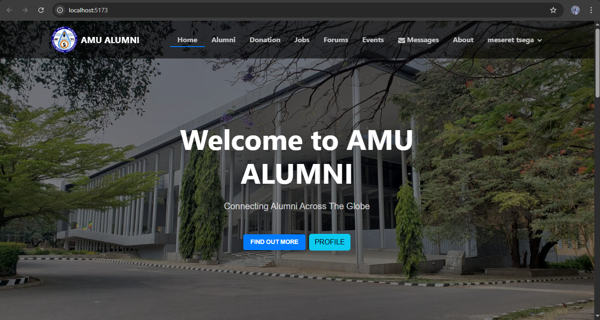
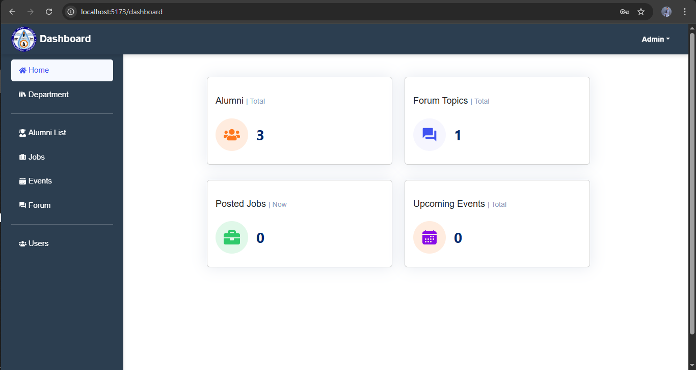
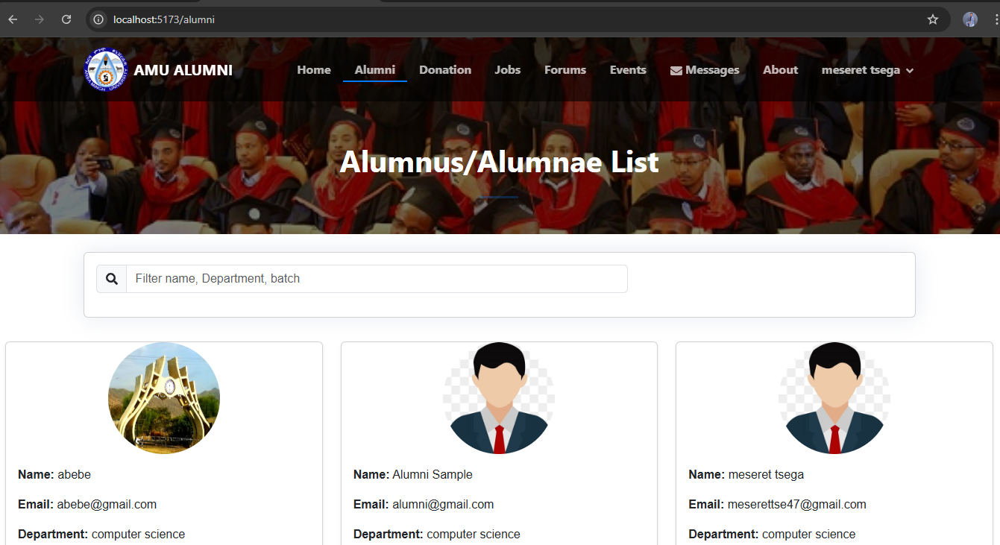
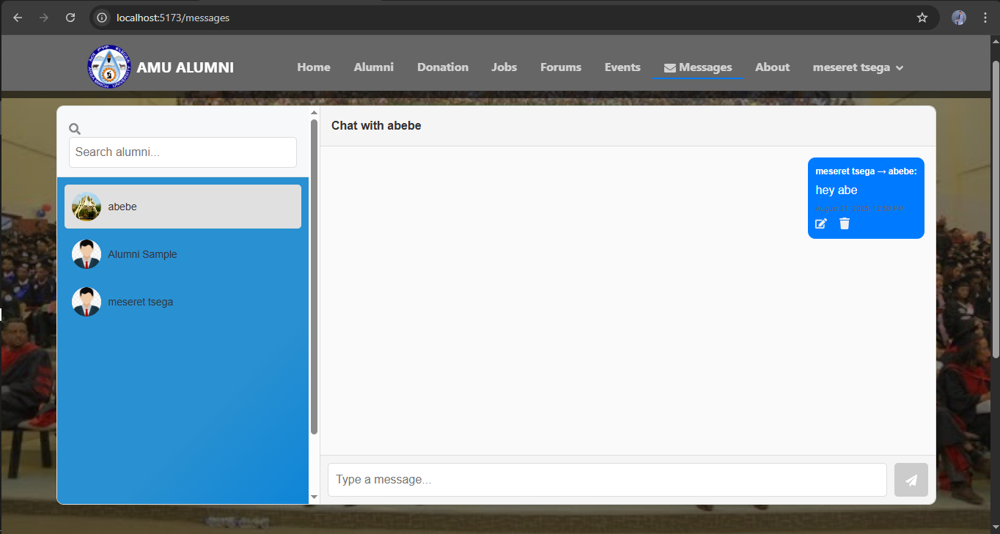

# Alumni Management System for Arba Minch University CS

The **Alumni Management System** is a web-based platform for **Arba Minch University** that connects alumni with the university. It enables **registration, job postings, events, forums, donations, and messaging**, fostering networking, professional growth, and lifelong engagement.

---

## Features

- Alumni registration and profile management  
- Admin verification of alumni accounts  
- Faculty officer registration and management  
- Search and filter alumni by name, department, or batch  
- Job and career posting  
- Events and forums management  
- Donations to support faculty  
- Messaging between alumni and faculty officers  
- Admin dashboard for user and content management  

---

## Screenshots  

- **Homepage**  
  

- **Admin Homepage**  
  

- **All Users List (Admin Panel)**  
  

- **Alumni List on Admin Page**  
  

- **Alumni List**  
  

- **Job List**  
  

- **Messaging**  
  

---

## Getting Started  

### Prerequisites

- [Node.js](https://nodejs.org/) (v14 or higher)  
- [npm](https://www.npmjs.com/)  
- [MySQL](https://www.mysql.com/) (for database)  

---

### 1. Clone the Repository  

```sh
git clone https://github.com/meserettsega/alumni-management-system.git
cd alumni-management-system
